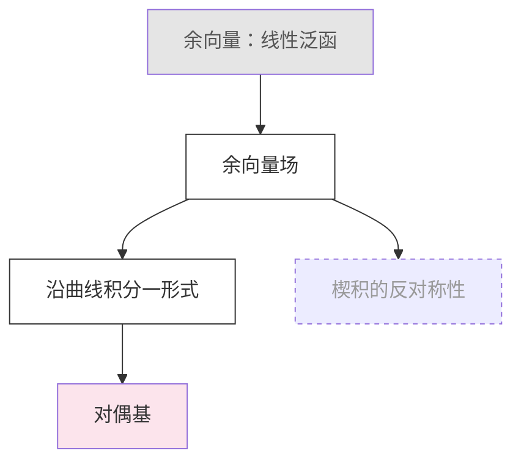

# 日志与文件规范

pi 的会话本身可以用 `/export` 导出，但那是流水记录。这里要产生的是可长期检索的学习资料，写入 Obsidian 库，用 `write` 与 `edit` 工具维护。以下路径全部相对当前工作目录（学习目录），不是技能目录；具体子目录名以学习目录根部的 `AGENTS.md` 为准。

## 目录结构与 slug

```
PiLearn/
├── AGENTS.md                          学习目录约定，pi 启动时自动加载
├── LEARNER.md                         学习者档案，跨会话累积
├── maps/<slug>.md                      依赖图
├── sessions/YYYY-MM-DD-<slug>.md       会话记录
└── attachments/                       SVG 与其他图像
```

每个主题有一个 slug 作为文件名：优先用通行的英文名（`differential-forms`），没有通行英文名才用拼音（`ci-yu-qian-ru`），短横线连接、全小写，避免与库中既有笔记同名，一经写入不再更改。slug 记在会话文件与地图文件的 frontmatter，以及 `LEARNER.md`「未竟」条目的括号里，续学时据此定位文件。同一主题多次会话时，日期不同即为不同文件；同日同主题的第二次会话加序号后缀（`-2`），写入前执行 `ls sessions` 检查。地图文件原地更新。

## 写入时机

不要每说一句就写一次。写入分六个时点：

1. 阶段 0 结束时用 `write` 创建会话文件（按下面的模板，占位行照写）。
2. 摸底结束时以理解地图替换「起点」节的占位行；摸底中用到公式的题目写入「摸底题目」节；同时更新 `LEARNER.md` 的稳固、似懂非懂、空白三节（带日期）。
3. 计划生成时用 `write` 创建 `maps/<slug>.md`，并以 `![[maps/<slug>]]` 替换会话文件「计划」节的占位行；学习者确认或调整后用 `edit` 原地修改地图，不重写整个文件。
4. 每个节点通过检验后，追加该节点的正式内容、例子与检验结果；同时把地图中该节点的状态改为 `:::done`。
5. 每道累积题后，追加「累积检验」节的内容，并更新 `LEARNER.md` 的「未竟」条目（渐进式保存，学习者中途关闭终端也不丢状态）。
6. 收尾时填写「小结」「习题」「术语与延伸阅读」三节，把 frontmatter 的 `状态` 改为 `已完成`、`未竟` 或 `仅摸底`（只摸底模式在摸底结束时即改），更新 `LEARNER.md`。

## 追加与修改的方法

pi 的 `edit` 是精确、唯一匹配的替换，不是追加，因此每处写入都有固定锚点；锚点行在文件中必须唯一，标题行之外不要复用这些字符串。已有的会话文件、地图文件与 `LEARNER.md` 一律不用 `write` 覆盖。

- 一次性写入的节（摸底题目、起点、计划、小结、习题、术语与延伸阅读）：模板里的括号占位行照写入文件；首次写入时以该占位行整行为 oldText，用实际内容替换，既作唯一锚点又不残留。
- 节点内容：以 `## 累积检验` 这一行为 oldText，newText 为「节点内容 + 空行 + `## 累积检验`」，节点因此按顺序落在「计划」之后、「累积检验」之前。
- 累积题：以 `## 支线待办` 为锚，同法插入。
- 支线待办条目：以 `## 小结` 为锚，同法插入。
- 地图状态：oldText 用完整的 `id["标签"]:::旧状态`，newText 只换状态后缀；插入节点与变更记录以 `## 路径说明` 或 `## 变更记录` 标题行为锚。`edit` 报重复或找不到时先 `read` 重读文件再重试，禁止改用 `write`。

## 会话文件模板

创建时的样子如下，括号内是占位行：

````markdown
---
主题: "微分形式"
slug: differential-forms
日期: 2026-09-01
开始时刻: "20:05"
目标: "能读懂并解释广义斯托克斯定理的陈述"
节点预算: 7
状态: 进行中
---

# 微分形式 · 2026-09-01

## 摸底题目
（题干必须用公式时写入本节，否则保留本行）

## 起点
（摸底结束时以理解地图替换本行；续学时写「续自 YYYY-MM-DD」与复核结果）

## 计划
（计划确认后以 ![[maps/differential-forms]] 替换本行）

## 累积检验

## 支线待办

## 小结
（收尾时替换本行）

## 习题
（收尾时替换本行）

## 术语与延伸阅读
（收尾时替换本行）
````

节点内容插入后的形态：

````markdown
## 节点 1 · 余向量
> **定义 1.1（余向量，covector）** …

（逐句拆解、例子）

**检验** $\alpha = 3\,dx - 2\,dy$，$V = (2, 5)$，求 $\alpha(V)$。答：$-4$。通过。

## 累积检验
````

frontmatter 约束：`主题` 与 `目标` 一律加双引号，值内的双引号写作 `\"`；`开始时刻` 加引号，避免被解析成数字；其余字段的值若含半角冒号加空格、空格加井号，或以 `[`、`{`、`*`、`&`、`%`、`@`、反引号、引号开头，也必须加引号。`状态` 的取值固定为四个：`进行中`、`已完成`、`未竟`、`仅摸底`，便于日后检索。`日期` 用 ISO 格式，Obsidian 会识别为日期类型。

## 地图文件模板

````markdown
---
主题: "微分形式"
slug: differential-forms
目标: "能读懂并解释广义斯托克斯定理的陈述"
更新: 2026-09-01
---

# 依赖图 · 微分形式



图例：灰色为已掌握，白色为待教，虚线为可跳过，粉色为暂缓。

## 路径说明

## 排除的替代路线

## 变更记录
- 2026-09-01 插入 n2a「线性泛函的坐标表示」：n2 检验三次未过，判定为前置缺失
- 2026-09-01 n5 改为 defer：表述、前置、前置
````

mermaid 的语法约束，违反任何一条都会让 Obsidian 显示解析错误或让 `edit` 失去唯一锚点：

- 节点 id 一律用 ASCII（`n1`、`n2a`），一经写入不改；插入节点用相邻编号加字母。
- 标签一律加双引号；标签内不写 `[`、`]`、`(`、`)`、`{`、`}`、`|` 与 `$`（方括号与圆括号是节点形状语法，标签内不渲染 LaTeX）。
- 每个节点的 `id["标签"]:::状态` 在整张图里只在首次出现处写一次，其余边只用裸 id，例如 `n2 --> n4`。
- 状态只用 `:::done`、`:::todo`、`:::skip`、`:::defer` 四个样式类；改状态时 oldText 用完整的 `id["标签"]:::旧状态`，newText 只换后缀。
- 与其它主题共享的前置节点用 `[[maps/<另一 slug>]]` 在「路径说明」里链接引用，不复制。

## LEARNER.md

跨会话累积的学习者档案，只记录能减少下次摸底量的事实。每条记录都要带测定日期；三个月以上未复核的「稳固」条目，下次涉及时抽一道题复核，不直接采信。

文件不存在时用 `write` 按模板创建，五个二级标题都写上；存在时只用 `edit`：新增条目以对应标题行（如 `## 未竟`）为 oldText，newText 为标题行加换行加新条目；替换或删除旧条目时以该条目整行为 oldText。

```markdown
# 学习者档案

## 稳固
- 多元微积分：线积分、散度、旋度的物理意义（2026-09-01 测）

## 似懂非懂
- 斯托克斯定理的定向条件（2026-09-01 测）

## 空白
- 对偶空间、流形与坐标卡（2026-09-01 测）

## 偏好
- 要求先给动机再给形式陈述
- 例子偏好取自电磁学
- 每周可投入约 4 小时；资料偏好中文教材，英文论文可读

## 未竟
- 微分形式（differential-forms）：讲到 n5，广义斯托克斯未完成（2026-09-01）
- 线性代数（linear-algebra）：暂缓节点「对偶基」（三次：表述、前置、前置；2026-09-01）
- 范畴论（category-theory）：已摸底未规划（2026-09-03）
```

「未竟」条目固定为三种格式：讲到哪里、暂缓节点（附三次失败类型）、已摸底未规划，括号内是 slug。续学分支按条目类型决定复核与起点；主题完成后删除对应条目。

## Obsidian 渲染注意事项

- 行内数学用 `$...$`，独立公式用 `$$...$$`，Obsidian 以 MathJax 渲染。行内公式的开 `$` 之后与闭 `$` 之前不留空格，闭 `$` 后不紧跟数字；独立公式的 `$$` 单独成行且块内无空行；不用 `\(` `\[` 定界。
- mermaid 写在 ```mermaid 代码块中，Obsidian 原生渲染；约束见上。
- 嵌入地图用不带 `.md` 的路径后缀 `![[maps/<slug>]]`，Obsidian 按路径后缀解析；若显示为未解析链接，改为从库根起的完整路径。嵌入时不显示被嵌笔记的 frontmatter。
- SVG 写入 `attachments/`，在笔记中用 `![[attachments/xxx.svg]]` 嵌入。
- 内部链接用 `[[双方括号]]`，便于日后在库内形成关联。
